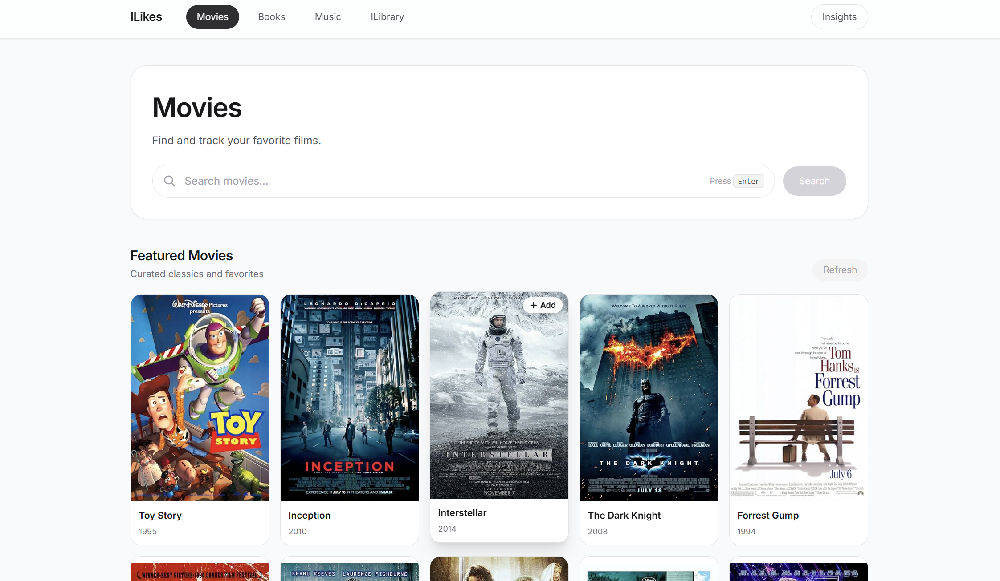
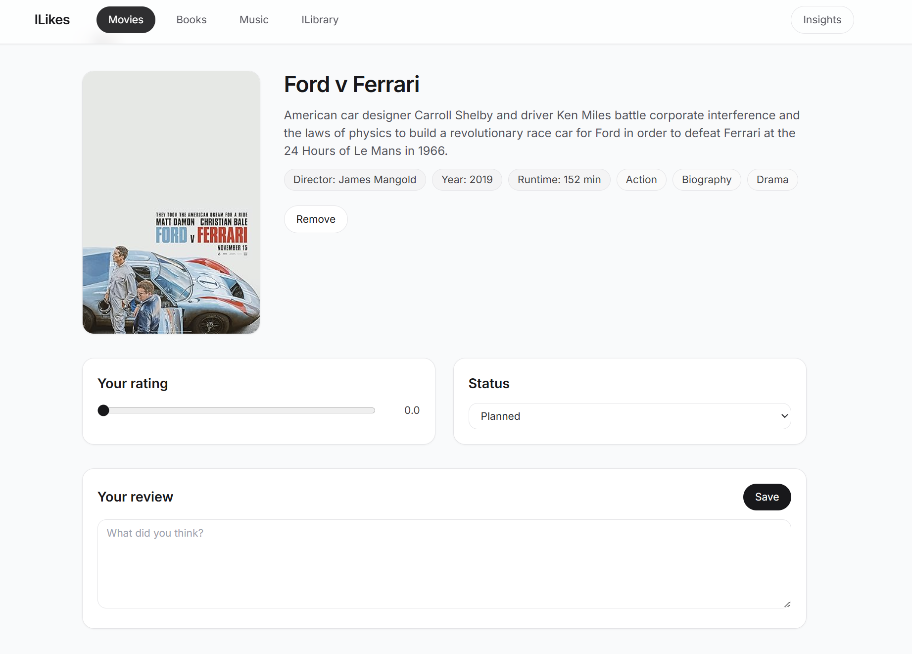
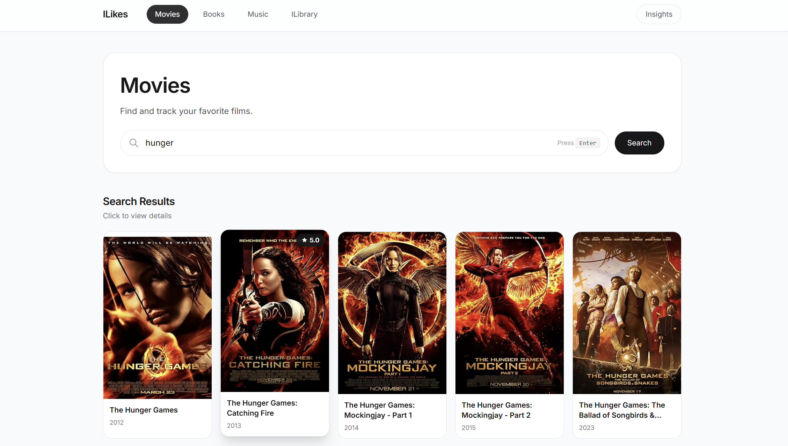
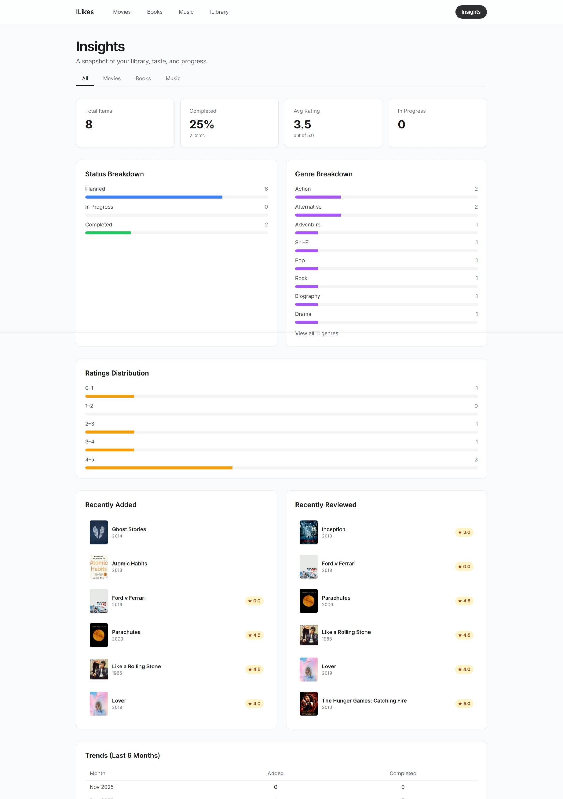

# ILikes

ILikes is a React + TypeScript app for discovering and tracking movies, books, and music in one place.

You can:
- search media from external providers,
- save items to your personal library,
- add status/rating/review metadata,
- and view analytics in an insights dashboard.

## Highlights

- Multi-source discovery
  - Movies: OMDb
  - Books: Google Books
  - Music: iTunes Search
- Personal library workflow
  - Add items from search results
  - Track status: Planned, In Progress, Completed
  - Save personal rating and review
- Library management tools
  - Search within your saved entries
  - Filter by status/rating/genre
  - Sort by recently added, title, rating, year, or status
- Insights dashboard
  - Total items, completion %, average rating
  - Status and genre breakdowns
  - Rating distribution
  - Recently added/reviewed
  - Monthly activity trends
- Local-first persistence
  - Library and activity log are stored in browser localStorage

## Screenshots

### Home / Discovery


### Media Details


### Search + Saved State


### Insights Dashboard


## Tech Stack

- React 18
- TypeScript
- Vite 5
- Tailwind CSS
- React Router DOM
- Axios
- Vitest

## Project Structure

```text
src/
     analytics/     # analytics helpers + tests
     components/    # reusable UI
     hooks/         # custom hooks (library state)
     lib/           # types, storage, insights, utilities
     pages/         # route pages (discover, detail, library, insights)
     providers/     # external API adapters
```

## Routes

- `/movies`, `/movies/:id`
- `/books`, `/books/:id`
- `/music`, `/music/:id`
- `/library`
- `/library/movies`
- `/library/books`
- `/library/music`
- `/insights`

## Getting Started

### 1) Install dependencies

```bash
npm install
```

### 2) Configure environment variables

Copy `.env.example` to `.env` and set your API keys:

```env
VITE_OMDB_API_KEY=your_omdb_key
VITE_GOOGLE_BOOKS_API_KEY=your_google_books_key
VITE_ITUNES_API_KEY=optional
```

Notes:
- OMDb and Google Books keys are required for full movie/book search.
- iTunes search currently works without an API key.

### 3) Run the app

```bash
npm run dev
```

Open the local URL shown by Vite (typically `http://localhost:5173`).

## Scripts

- `npm run dev` — start development server
- `npm run build` — type-check and build for production
- `npm run preview` — preview production build
- `npm run lint` — run ESLint on source files
- `npm test` — run Vitest tests
- `npm run test:ui` — run Vitest with UI

## Data Model Summary

Each saved library item stores:
- media type/provider/external ID
- title/image/year/genres snapshot
- user metadata (status, rating, review, spoiler flag, tags)
- timestamps and revisit/completion fields

This allows the app to keep a stable local history even if external metadata changes.

## License

Private project.
